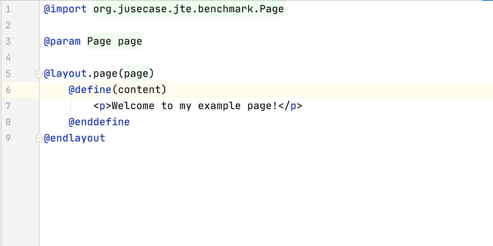

# jte (Java Template Engine)
[](https://travis-ci.org/casid/jte)
[](https://coveralls.io/github/casid/jte?branch=master)
[](https://raw.githubusercontent.com/casid/jte/master/LICENSE)
[](http://mvnrepository.com/artifact/org.jusecase/jte)

jte is a simple, yet powerful template engine for Java. All jte templates are compiled to Java class files, meaning jte adds essentially zero overhead to your application. jte is designed to introduce as few new keywords as possible and builds upon existing Java features, so that it is very easy to reason about what a template does. The <a href="https://plugins.jetbrains.com/plugin/14521-jte">IntelliJ plugin</a> offers full completion and refactoring support for Java parts as well as for jte keywords. Supports Java 11 or higher.

## Features
- Intuitive, easy to learn [syntax](DOCUMENTATION.md).
- Blazing fast execution, about <a href="https://github.com/casid/template-benchmark/">100k templates rendered per second</a> on a MacBook Pro 2015.
- Small footprint, no external dependencies. The jar is ~60 KB.
- <a href="https://plugins.jetbrains.com/plugin/14521-jte">IntelliJ plugin</a> offering completion and refactoring support.
- Hot reloading of templates during development.

## TLDR

jte is a lot of fun to work with! Have a look how it feels like in IntelliJ with the <a href="https://plugins.jetbrains.com/plugin/14521-jte">jte plugin</a> installed:



## 5 minutes example

Here is a small jte template `example.jte`:
```htm
@import org.example.Page

@param Page page

<head>
    @if(page.getDescription() != null)
        <meta name="description" content="${page.getDescription()}">
    @endif
    <title>${page.getTitle()}</title>
</head>
<body>
    <h1>${page.getTitle()}</h1>
    <p>Welcome to my example page!</p>
</body>
```

So what is going on here?
- `@import` directly translates to Java imports, in this case so that `org.example.Page` is known to the template.
- `@param Page page` is the parameter that needs to be passed to this template.
- `@if`/`@endif` is an if-block. The stuff inside the braces (`page.getDescription() != null`) is plain Java code. @JSP users: Yes, there is `@elseif()` and `@else` in jte ❤️.
- `${}` finally writes to the underlying template output, as known from various other template engines.

To render this template, an instance of `TemplateEngine` is required. Typically you create it once per application (it is safe to share the engine between threads):
```java
CodeResolver codeResolver = new DirectoryCodeResolver(Path.of("jte")); // This is the directory where your .jte files are located.
TemplateEngine templateEngine = new TemplateEngine(codeResolver);
```

With the `TemplateEngine` ready, templates are rendered like this:
```java
TemplateOutput output = new StringOutput();
templateEngine.render("example.jte", page, output);
System.out.println(output);
```

> Besides `StringOutput`, there are several other `TemplateOutput` implementations you can use, or create your own if required.

In most cases you have multiple pages that share a lot of common html. This is where jte layouts shine! 

> All layouts must be created in a directory called `layout` in your template root directory.

Let's move stuff from our example page to `layout/page.jte`:

```htm
@import org.example.Page

@param Page page

<head>
    @if(page.getDescription() != null)
        <meta name="description" content="${page.getDescription()}">
    @endif
    <title>${page.getTitle()}</title>
</head>
<body>
    <h1>${page.getTitle()}</h1>
    @render(content)
</body>
```

`@render` is what makes layouts very powerful. The `@render(content)` is a placeholder that can be provided by callers of the template. Let's refactor `example.jte` to use the new layout:

```htm
@import org.example.Page

@param Page page

@layout.page(page)
    @define(content)
        <p>Welcome to my example page!</p>
    @enddefine
@endlayout
```

Check out the [syntax documentation](DOCUMENTATION.md), for a more comprehensive introduction.

## Performance
By design, jte provides very fast output. This is a <a href="https://github.com/casid/template-benchmark/">fork of mbosecke/template-benchmark</a> with jte included, running on a MacBook Pro 2015:


## Getting started

jte is available on <a href="http://mvnrepository.com/artifact/org.jusecase/jte">Maven Central</a>:

### Maven
```xml
<dependency>
    <groupId>org.jusecase</groupId>
    <artifactId>jte</artifactId>
    <version>0.3.0</version>
</dependency>
```

### Gradle
```groovy
compile group: 'org.jusecase', name: 'jte', version: '0.3.0'
```

Check out the [syntax documentation](DOCUMENTATION.md) and start hacking :-)

## Websites rendered with jte

- <a href="https://mazebert.com">Mazebert TD (game website)</a>
