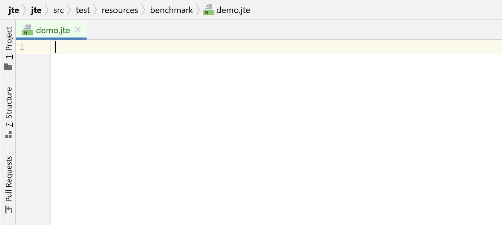

# jte: Java Template Engine

jte (**J**ava **T**emplate **E**ngine) is a secure and lightweight template engine for Java and Kotlin. jte is designed to introduce as few new keywords as possible and builds upon existing language features, making it straightforward to reason about what a template does. The [IntelliJ plugin][intellij-plugin] offers full completion and refactoring support for Java parts and jte keywords.

[][maven-central]

🚀 jte 3 is here! Check out the [release notes](https://github.com/casid/jte/releases/tag/3.0.0) for exciting new features, improved performance, and streamlined dependencies.

## Features

- Intuitive and easy syntax, you'll rarely need to check the [documentation](https://jte.gg/)
- Write plain Java or Kotlin for expressions. You don't need to learn yet another expression language
- Context-sensitive [HTML escaping](https://jte.gg/html-rendering/#html-escaping) at compile time
- [IntelliJ plugin][intellij-plugin] with completion and refactoring support
- Hot reloading of templates during development
- Blazing fast execution ([see benchmarks](https://jte.gg/#performance))

## tl;dr

jte gives you the same productive, typesafe experience you're used to from writing Java or Kotlin. Here is a quick demo of the [IntelliJ jte plugin][intellij-plugin]:

## Documentation

Documentation lives in the [jte website](https://jte.gg/).

## Framework integration

- [Javalin](https://javalin.io/tutorials/jte)
- [Eclipse Vert.x](https://github.com/vert-x3/vertx-web/tree/master/vertx-template-engines/vertx-web-templ-jte)
- [Spring Boot](https://github.com/casid/jte-spring-boot-demo)
- [Spring Web MVC 5](https://github.com/izogfif/demo-spring-jte)
- [Spring Web MVC 6](https://github.com/tntim96/demo-spring-web-mvc-6-jte)
- [Ktor](https://ktor.io/docs/jte.html)
- [Micronaut](https://micronaut-projects.github.io/micronaut-views/latest/guide/#jte)
- [Quarkus](https://github.com/renannprado/quarkus-jte-extension/)
- [Severell](https://github.com/severell/severell-jte-plugin)
- [http4k](https://www.http4k.org/guide/reference/templating)

## Websites rendered with jte

- [Mazebert TD (game website)](https://mazebert.com)
- [Javalin website example with login and multiple languages](https://github.com/casid/jte-javalin-tutorial)
- [FlowCrypt Admin Panel](https://flowcrypt.com/docs/technical/enterprise-admin-panel/usage/ui-overview.html)
- [Noticeable Newspages](https://noticeable.io)
- [Demeter Car Rental](https://www.demetercar.de)

[intellij-plugin]: https://plugins.jetbrains.com/plugin/14521-jte "IntelliJ jte Plugin"
[template-benchmark]: https://github.com/casid/template-benchmark/ "Template Benchmarks"
[maven-central]: https://central.sonatype.com/artifact/gg.jte/jte "jte in Maven Central"
