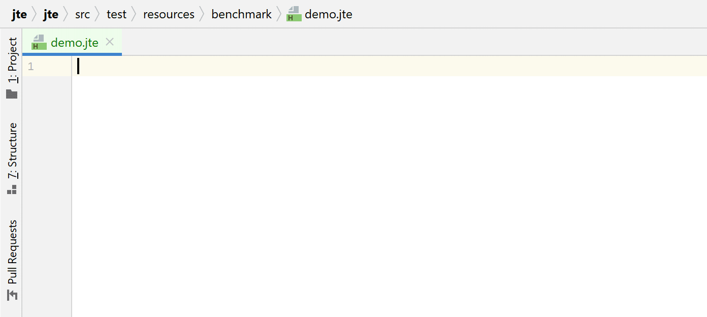

# jte: Java Template Engine

jte (**J**ava **T**emplate **E**ngine) is a secure and lightweight template engine for Java and Kotlin. jte is designed to introduce as few new keywords as possible and builds upon existing language features, making it straightforward to reason about what a template does. The [IntelliJ plugin][intellij-plugin] offers full completion and refactoring support for Java parts and jte keywords.

[](https://github.com/casid/jte/actions)
[](https://codecov.io/gh/casid/jte)
[](https://raw.githubusercontent.com/casid/jte/master/LICENSE)
[](http://mvnrepository.com/artifact/gg.jte/jte)

!!! tip "jte 3 is here!"

    Check out the [release notes](https://github.com/casid/jte/releases/tag/3.0.0) for exciting new features, improved performance, and streamlined dependencies.

## Features

<div class="grid cards" markdown>

- **Intuitive and easy syntax**, you'll rarely need to check these docs.
- **Write plain Java or Kotlin for expressions**. You don't need to learn yet another expression language
- **Context-sensitive [HTML escaping](html-rendering.md#html-escaping)** at compile time
- **[IntelliJ plugin][intellij-plugin]** with completion and refactoring support
- **[Hot reloading](hot-reloading.md)** of templates during development
- **Blazing fast** execution ([see benchmarks](#performance))

</div>

## Getting started

jte is available on [Maven Central][maven-central]:

=== "Maven"

    ```xml linenums="1" title="in your pom.xml"
    <dependency>
        <groupId>{{ POM_GROUP_ID }}</groupId>
        <artifactId>jte</artifactId>
        <version>{{ POM_VERSION }}</version>
    </dependency>
    ```

=== "Gradle"

    ```groovy linenums="1" title="in your build.gradle"
    implementation("{{ POM_GROUP_ID }}:jte:{{ POM_VERSION }}")
    ```

No further dependencies are required! Check out the [syntax documentation](syntax.md) and have fun with jte.

## IntelliJ Plugin

jte gives you the same productive, typesafe experience you're used to from writing Java or Kotlin. Here is a quick demo of the [IntelliJ jte plugin][intellij-plugin]:



## 5 minutes example

Here is a small jte template `example.jte`:

=== "Java"

    ```html linenums="1"
    @import org.example.Page

    @param Page page

    <head>
        @if(page.getDescription() != null)
            <meta name="description" content="${page.getDescription()}">
        @endif
        <title>${page.getTitle()}</title>
    </head>
    <body>
        <h1>${page.getTitle()}</h1>
        <p>Welcome to my example page!</p>
    </body>
    ```

=== "Kotlin"

    ```html linenums="1"
    @import org.example.Page

    @param page: Page

    <head>
        @if(page.description != null)
            <meta name="description" content="${page.description}">
        @endif
        <title>${page.title}</title>
    </head>
    <body>
        <h1>${page.title}</h1>
        <p>Welcome to my example page!</p>
    </body>
    ```

So what is going on here?

- `@import` directly translates to Java/Kotlin imports, in this case, so that `org.example.Page` is known to the template.
- `@param Page page` is the parameter that needs to be passed to this template.
- `@if`/`@endif` is an if-block. The stuff inside the parentheses (`#!java page.getDescription() != null`) is plain Java code.
- `${}` writes to the underlying template output, as known from various other template engines.

To render this template, an instance of `gg.jte.TemplateEngine` is required. Typically, you create it once per application (it is safe to share the engine between threads):

=== "Java"

    ```java linenums="1"
    import gg.jte.CodeResolver;
    import gg.jte.TemplateEngine;
    import gg.jte.resolve.DirectoryCodeResolver;

    ...

    CodeResolver codeResolver = new DirectoryCodeResolver(Path.of("jte")); // This is the directory where your .jte files are located.
    TemplateEngine templateEngine = TemplateEngine.create(codeResolver, ContentType.Html); // Two choices: Plain or Html
    ```

=== "Kotlin"

    ```kotlin linenums="1"
    import gg.jte.CodeResolver
    import gg.jte.TemplateEngine
    import gg.jte.resolve.DirectoryCodeResolver

    ...

    val codeResolver = DirectoryCodeResolver(Path.of("kte")) // This is the directory where your .kte files are located.
    val templateEngine = TemplateEngine.create(codeResolver, ContentType.Html) // Two choices: Plain or Html
    ```

    The content type passed to the engine determines how user output will be escaped. If you render HTML files, `ContentType.Html` is highly recommended. This enables the engine to analyze HTML templates at compile time and perform context sensitive output escaping of user data to prevent you from [XSS attacks](https://owasp.org/www-community/attacks/xss/).

With the `gg.jte.TemplateEngine` ready, templates are rendered like this:

=== "Java"

    ```java linenums="1"
    import gg.jte.TemplateOutput;
    import gg.jte.output.StringOutput;

    ...

    TemplateOutput output = new StringOutput();
    templateEngine.render("example.jte", page, output);
    System.out.println(output);
    ```

=== "Kotlin"

    ```kotlin linenums="1"
    import gg.jte.TemplateOutput
    import gg.jte.output.StringOutput

    ...

    val output = StringOutput()
    templateEngine.render("example.kte", page, output)
    println(output)
    ```

!!! info "`TemplateOutput` implementations"

    Besides `gg.jet.output.StringOutput`, you can use several other `gg.jte.TemplateOutput` implementations or create your own if required.

    - `gg.jte.output.StringOutput` - writes to a `String`
    - `gg.jte.output.FileOutput` - writes to the given `java.io.File`
    - `gg.jte.output.PrintWriterOutput` - writes to a `PrintWriter`, for instance, the writer provided by `HttpServletRequest`
    - `gg.jte.output.WriterOutput` - writes to a `java.io.Writer`

If you had more than one page like `example.jte`, you would have to duplicate a lot of shared template code. Let's extract the shared code into a reusable template.

Let's move stuff from our example page to `layout.jte`:

=== "Java"

    ```html linenums="1"
    @import org.example.Page
    @import gg.jte.Content

    @param Page page
    @param Content content

    <head>
        @if(page.getDescription() != null)
            <meta name="description" content="${page.getDescription()}">
        @endif
        <title>${page.getTitle()}</title>
    </head>
    <body>
        <h1>${page.getTitle()}</h1>
        ${content}
    </body>
    ```

=== "Kotlin"

    ```html linenums="1"
    @import org.example.Page
    @import gg.jte.Content

    @param page: Page
    @param content: Content

    <head>
        @if(page.description != null)
        <meta name="description" content="${page.description}">
        @endif
        <title>${page.title}</title>
    </head>
    <body>
        <h1>${page.title}</h1>
        ${content}
    </body>
    ```

The `@param Content content` is a content block that callers of the template can provide. `${content}` renders this content block. Let's refactor `example.jte` to use the new template:

=== "Java"

    ```html linenums="1"
    @import org.example.Page

    @param Page page

    @template.layout(page = page, content = @`
        <p>Welcome to my example page!</p>
    `)
    ```

=== "Kotlin"

    ```html linenums="1"
    @import org.example.Page

    @param page: Page

    @template.layout(page = page, content = @`
    <p>Welcome to my example page!</p>
    `)
    ```

The shorthand to create content blocks within jte templates is an `@` followed by two backticks. For advanced stuff, you can even create Java methods that return custom `gg.jte.Content` implementation and call it from your template code!

Check out the [syntax documentation](syntax.md) for a more comprehensive introduction.

## Performance

By design, jte provides very fast output. This is a [fork of mbosecke/template-benchmark][template-benchmark] with jte included, running on AMD Ryzen 5950x (single thread):


### High concurrency

This is the same benchmark as above, but the amount of threads was set to `#!java @Threads(16)`, to fully utilize all cores. jte has pretty much zero serialization bottlenecks and runs very concurrent on servers with many CPU cores:


## Framework integration

- [Javalin](https://javalin.io/tutorials/jte)
- [Eclipse Vert.x](https://github.com/vert-x3/vertx-web/tree/master/vertx-template-engines/vertx-web-templ-jte)
- [Spring Boot](https://github.com/casid/jte-spring-boot-demo)
- [Spring Web MVC](https://github.com/izogfif/demo-spring-jte)
- [Ktor](https://ktor.io/docs/jte.html)
- [Micronaut](https://micronaut-projects.github.io/micronaut-views/latest/guide/#jte)
- [Quarkus](https://github.com/renannprado/quarkus-jte-extension/)
- [Severell](https://github.com/severell/severell-jte-plugin)
- [http4k](https://www.http4k.org/guide/reference/templating)

## Websites rendered with jte

- [The jte website](https://jte.gg) ([Source](https://github.com/casid/jte-website))
- [Mazebert TD (game website)](https://mazebert.com)
- [Javalin website example with login and multiple languages](https://github.com/casid/jte-javalin-tutorial)
- [Mitch Dennett's Blog](https://www.mitchdennett.com/)
- [FlowCrypt Admin Panel](https://flowcrypt.com/docs/business/enterprise-admin-panel.html)

[intellij-plugin]: https://plugins.jetbrains.com/plugin/14521-jte "IntelliJ JTE Plugin"
[template-benchmark]: https://github.com/casid/template-benchmark/ "Template Benchmarks"
[maven-central]: http://mvnrepository.com/artifact/gg.jte/jte "jte in Maven Central"
